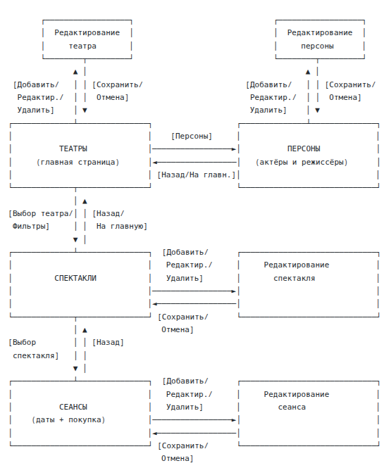
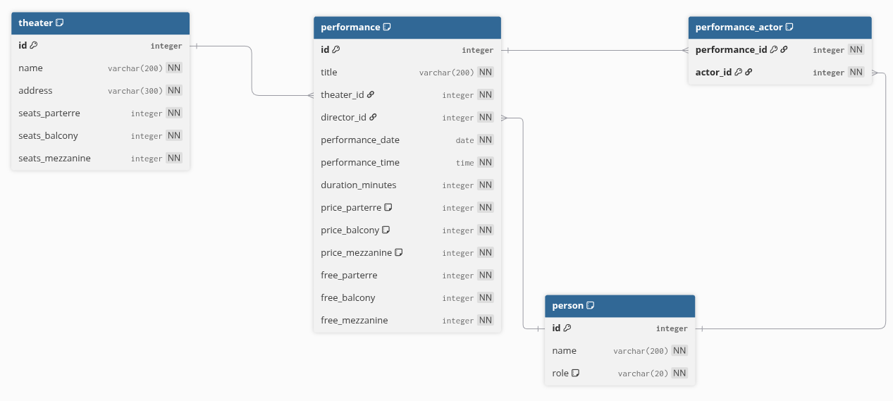

# Практикум: Театральная касса (16 вариант)

# **Перечень сценариев использования**

## Сценарий 1: Просмотр списка театров и поиск представлений

Пользователь заходит на главную страницу, где видит список всех театров. Он может выбрать конкретный театр для просмотра его представлений, либо воспользоваться фильтрами для поиска представлений по режиссеру, актеру или дате проведения. После применения фильтров отображается список подходящих представлений.

Шаги выполнения:

Шаг 1: Пользователь открывает главную страницу (Страница "Театры")  
Шаг 2: Пользователь просматривает список театров или использует фильтры поиска  
Шаг 3: Пользователь выбирает театр или применяет фильтры  
Шаг 4: Система отображает список представлений с учетом фильтрации (Страница "Представления")

## Сценарий 2: Покупка билета на представление

Пользователь выбирает интересующее представление из списка, переходит на страницу с детальной информацией о нем, где видит доступные места и цены. Затем выбирает тип места и количество билетов, после чего оформляет покупку.

Шаги выполнения:

Шаг 1: Пользователь находит представление (Страница "Представления")  
Шаг 2: Пользователь нажимает на представление для просмотра деталей (Страница "Детали представления")  
Шаг 3: Пользователь видит информацию о свободных местах и ценах  
Шаг 4: Пользователь выбирает тип места, количество билетов и нажимает "Купить"  
Шаг 5: Система уменьшает количество свободных мест и подтверждает покупку

## 

## Сценарий 3: Управление театрами

Администратор добавляет новый театр в систему, указывая название, адрес и количество мест разных типов. Также он может редактировать данные существующего театра или удалить театр из системы.

Шаги выполнения:

Шаг 1: Администратор открывает страницу управления театрами (Страница "Театры")  
Шаг 2: Для добавления \- нажимает "Добавить театр", заполняет форму (Страница "Редактирование театра")  
Шаг 3: Для редактирования \- нажимает "Редактировать" у нужного театра, изменяет данные  
Шаг 4: Для удаления \- нажимает "Удалить" у нужного театра и подтверждает действие  
Шаг 5: Система сохраняет изменения и возвращает на список театров

## Сценарий 4: Управление представлениями

Администратор создает новое представление, указывая режиссера, актеров, дату и время проведения, продолжительность, цены на билеты разных типов. Театр уже известен из контекста. Информация о свободных местах автоматически берется из данных театра. Также можно редактировать и удалять представления.

Шаги выполнения:

Шаг 1: Администратор открывает список представлений (Страница "Представления")  
Шаг 2: Для добавления \- нажимает "Добавить представление", переходит на страницу "Редактирование представления" и заполняет форму: выбирает режиссёра из выпадающего списка, выбирает актёров, указывает название, дату, время, продолжительность и цены  
Шаг 3: Для редактирования \- нажимает "Редактировать" у нужного представления, переходит на страницу "Редактирование представления" и изменяет данные (театр не редактируется)  
Шаг 4: Для удаления \- нажимает "Удалить" у нужного представления и подтверждает действие  
Шаг 5: Система сохраняет изменения и возвращает на список представлений

# **Перечень страниц приложения**

## Страница 1: Театры (главная страница)

Данные на странице: список всех театров с их названиями и адресами, фильтры для поиска представлений (по режиссеру, актеру, дате).

Доступные действия: просмотр списка театров, выбор театра для просмотра его представлений, применение фильтров поиска, переход к добавлению/удалению/редактированию театра.

## Страница 2: Представления

Данные на странице: список представлений (отфильтрованный), для каждого представления показывается название, театр, дата и время, режиссер.

Доступные действия: просмотр списка представлений, выбор представления для просмотра деталей, переход к добавлению/удалению/редактированию представления, возврат на главную страницу.

## Страница 3: Детали представления

Данные на странице: полная информация о представлении \- название, театр, режиссер, список актеров, дата и время, продолжительность, количество свободных мест по типам (партер, балкон, бельэтаж), стоимость билетов по типам.

Доступные действия: выбор типа места и количества билетов, покупка билетов, возврат к списку представлений.

## Страница 4: Редактирование театра

Данные на странице: форма с полями \- название театра, адрес, количество мест в партере, количество мест на балконе, количество мест в бельэтаже.

Доступные действия: заполнение/изменение полей формы, сохранение данных, отмена и возврат к списку театров.

## Страница 5: Редактирование представления

Данные на странице: форма с полями \- название представления, название театра (только отображение, не редактируется), выпадающий список режиссеров (можно изменить), множественный выбор актёров, дата проведения, время проведения, продолжительность, цена билета в партер, цена билета на балкон, цена билета в бельэтаж.

Доступные действия: заполнение/изменение полей формы, сохранение данных, отмена и возврат к списку представлений.

# **Схема навигации между страницами**

Со страницы "Театры" можно перейти на страницу "Представления" (при выборе театра или применении фильтров) и на страницу "Редактирование театра" (при добавлении, удалении или редактировании театра).

Со страницы "Представления" можно перейти на страницу "Детали представления" (при выборе конкретного представления), на страницу "Редактирование представления" (при добавлении, удалении или редактировании) и вернуться на страницу "Театры".

Со страницы "Детали представления" можно вернуться на страницу "Представления".

Со страницы "Редактирование театра" можно вернуться на страницу "Театры" (после сохранения или отмены).

Со страницы "Редактирование представления" можно вернуться на страницу "Представления" (после сохранения или отмены).

# **Схема базы данных**

## Таблица theater \- хранит информацию о театрах. 
id (INTEGER, PRIMARY KEY, AUTOINCREMENT) \- уникальный идентификатор театра  
name (VARCHAR 200, NOT NULL) \- название театра  
address (VARCHAR 300, NOT NULL) \- адрес театра  
seats\_parterre (INTEGER, NOT NULL) \- количество мест в партере  
seats\_balcony (INTEGER, NOT NULL) \- количество мест на балконе  
seats\_mezzanine (INTEGER, NOT NULL) \- количество мест в бельэтаже

## Таблица person \- хранит информацию о людях (режиссёрах и актёрах).
id (INTEGER, PRIMARY KEY, AUTOINCREMENT) \- уникальный идентификатор персоны  
name (VARCHAR 200, NOT NULL) \- полное имя  
role (VARCHAR 20, NOT NULL) \- роль персоны, принимает значения: DIRECTOR (только режиссёр), ACTOR (только актёр), BOTH (и режиссёр, и актёр)

## Таблица performance \- хранит информацию о представлениях.
id (INTEGER, PRIMARY KEY, AUTOINCREMENT) \- уникальный идентификатор представления  
title (VARCHAR 200, NOT NULL) \- название представления  
theater\_id (INTEGER, NOT NULL, FOREIGN KEY) \- ссылка на театр (theater.id)  
director\_id (INTEGER, NOT NULL, FOREIGN KEY) \- ссылка на режиссёра (person.id)  
performance\_date (DATE, NOT NULL) \- дата проведения  
performance\_time (TIME, NOT NULL) \- время начала  
duration\_minutes (INTEGER, NOT NULL) \- продолжительность в минутах  
price\_parterre (INTEGER, NOT NULL) \- цена билета в партер (в рублях)  
price\_balcony (INTEGER, NOT NULL) \- цена билета на балкон (в рублях)  
price\_mezzanine (INTEGER, NOT NULL) \- цена билета в бельэтаж (в рублях)  
free\_parterre (INTEGER, NOT NULL) \- количество свободных мест в партере  
free\_balcony (INTEGER, NOT NULL) \- количество свободных мест на балконе  
free\_mezzanine (INTEGER, NOT NULL) \- количество свободных мест в бельэтаже

## Таблица performance\_actor \- связующая таблица для связи многие-ко-многим между представлениями и актёрами. 
performance\_id (INTEGER, NOT NULL, часть PRIMARY KEY, FOREIGN KEY) \- ссылка на представление (performance.id)  
actor\_id (INTEGER, NOT NULL, часть PRIMARY KEY, FOREIGN KEY) \- ссылка на актёра (person.id)

## Связи между таблицами:

Таблица performance связана с таблицей theater через поле theater\_id. Связь один-ко-многим: один театр может иметь много представлений, каждое представление проходит в одном театре.

Таблица performance связана с таблицей person через поле director\_id. Связь один-ко-многим: один режиссёр может ставить много представлений, каждое представление имеет одного режиссёра.

Таблицы performance и person связаны через промежуточную таблицу performance\_actor. Связь многие-ко-многим: одно представление может иметь много актёров, один актёр может участвовать во многих представлениях.

# **Отображение данных БД на страницы интерфейса**

Страница "Театры" отображает данные из таблицы theater: поля name и address для списка театров.

Страница "Представления" отображает данные из таблицы performance с присоединением таблиц theater и person. Показываются поля: title, theater.name, performance\_date, performance\_time, person.name (режиссер).

Страница "Детали представления" отображает все данные из таблицы performance, связанные данные из theater (название театра), из person (имя режиссёра), а также список актёров через таблицу performance\_actor с присоединением таблицы person.

Страница "Редактирование театра" работает с записью в таблице theater. Форма заполняет или изменяет все поля таблицы кроме id.

Страница "Редактирование представления" работает с записью в таблице performance и связанными записями в таблице performance\_actor. При добавлении создаётся новая запись в performance и записи в performance\_actor для выбранных актёров. При редактировании изменяются данные в performance (кроме theater\_id) и обновляются записи в performance\_actor. Поле director\_id может быть изменено через выпадающий список режиссёров.
