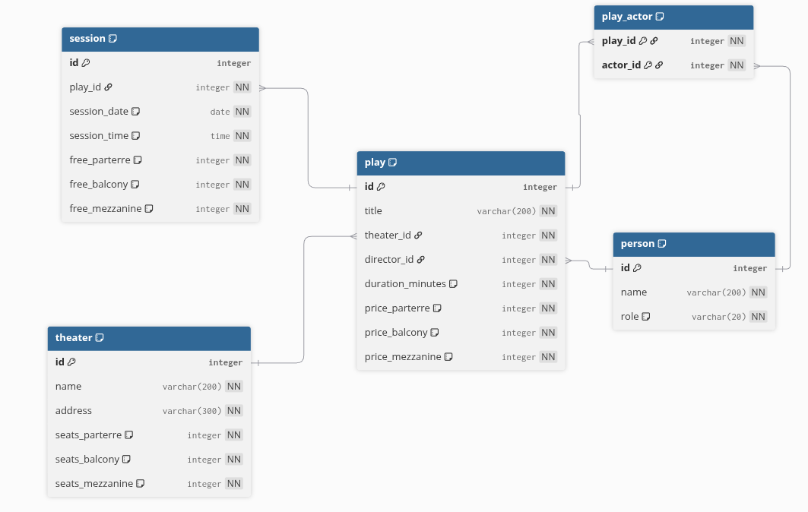

# **Практикум: Театральная касса (16 вариант)**

# **Перечень сценариев использования**

## Сценарий 1: Просмотр списка театров и поиск спектаклей

Пользователь заходит на главную страницу, где видит список всех театров. Он может выбрать конкретный театр для просмотра его спектаклей, либо воспользоваться фильтрами для поиска спектаклей по режиссеру, актеру или дате проведения. После применения фильтров отображается список подходящих спектаклей.

Шаги выполнения:

Шаг 1: Пользователь открывает главную страницу (Страница "Театры")  
Шаг 2: Пользователь просматривает список театров или использует фильтры поиска  
Шаг 3: Пользователь выбирает театр или применяет фильтры  
Шаг 4: Система отображает список спектаклей с учетом фильтрации (Страница "Спектакли")

## Сценарий 2: Покупка билета на сеанс

Пользователь выбирает интересующий спектакль из списка, переходит на страницу с сеансами этого спектакля, где видит доступные даты, свободные места и цены. Затем выбирает сеанс, тип места и количество билетов, после чего оформляет покупку.

Шаги выполнения:

Шаг 1: Пользователь находит спектакль (Страница "Спектакли")  
Шаг 2: Пользователь нажимает на спектакль для просмотра сеансов (Страница "Сеансы")  
Шаг 3: Пользователь видит список сеансов с датами, временем и свободными местами  
Шаг 4: Пользователь выбирает сеанс, тип места, количество билетов и нажимает "Купить"  
Шаг 5: Система уменьшает количество свободных мест на выбранном сеансе, показывает сообщение об успешной покупке, пользователь остаётся на странице "Сеансы"

## Сценарий 3: Управление театрами

Администратор добавляет новый театр в систему, указывая название, адрес и количество мест разных типов. Также он может редактировать данные существующего театра или удалить театр из системы.

Шаги выполнения:

Шаг 1: Администратор открывает страницу управления театрами (Страница "Театры")  
Шаг 2: Для добавления — нажимает "Добавить театр", переходит на страницу "Редактирование театра" и заполняет форму  
Шаг 3: Для редактирования — нажимает "Редактировать" у нужного театра, изменяет данные  
Шаг 4: Для удаления — нажимает "Удалить" у нужного театра и подтверждает действие  
Шаг 5: Система сохраняет изменения и возвращает на список театров

## Сценарий 4: Управление спектаклями

Администратор создает новый спектакль, указывая название, режиссера (из выпадающего списка), актеров (множественный выбор из списка), продолжительность и цены на билеты разных типов. Театр уже известен из контекста. Также можно редактировать и удалять спектакли.

Шаги выполнения:

Шаг 1: Администратор открывает список спектаклей (Страница "Спектакли")  
Шаг 2: Для добавления — нажимает "Добавить спектакль", переходит на страницу "Редактирование спектакля" и заполняет форму  
Шаг 3: Для редактирования — нажимает "Редактировать" у нужного спектакля, изменяет данные (театр не редактируется)  
Шаг 4: Для удаления — нажимает "Удалить" у нужного спектакля и подтверждает действие  
Шаг 5: Система сохраняет изменения и возвращает на список спектаклей

## Сценарий 5: Управление сеансами

Администратор добавляет новый сеанс для спектакля, указывая дату и время проведения. Количество свободных мест автоматически берётся из данных театра. Также можно редактировать и удалять сеансы.

Шаги выполнения:

Шаг 1: Администратор открывает список сеансов спектакля (Страница "Сеансы")  
Шаг 2: Для добавления — нажимает "Добавить сеанс", переходит на страницу "Редактирование сеанса" и заполняет форму  
Шаг 3: Для редактирования — нажимает "Редактировать" у нужного сеанса, изменяет данные  
Шаг 4: Для удаления — нажимает "Удалить" у нужного сеанса и подтверждает действие  
Шаг 5: Система сохраняет изменения и возвращает на список сеансов

## Сценарий 6: Управление персонами (актёрами и режиссёрами)

Администратор добавляет нового актёра или режиссёра в систему, указывая имя и роль. Также он может редактировать данные существующей персоны или удалить её из системы. После добавления персона становится доступной для выбора при создании/редактировании спектаклей.

Шаги выполнения:

Шаг 1: Администратор открывает страницу управления персонами (Страница "Персоны")  
Шаг 2: Для добавления — нажимает "Добавить персону", переходит на страницу "Редактирование персоны" и заполняет форму  
Шаг 3: Для редактирования — нажимает "Редактировать" у нужной персоны, изменяет данные  
Шаг 4: Для удаления — нажимает "Удалить" у нужной персоны и подтверждает действие  
Шаг 5: Система сохраняет изменения и возвращает на список персон

# **Перечень страниц приложения**

## Страница 1: Театры (главная страница)

Данные на странице: список всех театров с их названиями и адресами, фильтры для поиска спектаклей (по режиссеру, актеру, дате), ссылка на страницу "Персоны".

Доступные действия: просмотр списка театров, выбор театра для просмотра его спектаклей, применение фильтров поиска, переход к добавлению/редактированию/удалению театра, переход на страницу "Персоны".

## Страница 2: Спектакли

Данные на странице: список спектаклей (отфильтрованный или все спектакли театра), для каждого спектакля показывается название, театр, режиссёр, продолжительность.

Доступные действия: просмотр списка спектаклей, выбор спектакля для просмотра сеансов, переход к добавлению/редактированию/удалению спектакля, возврат на главную страницу.

## Страница 3: Сеансы

Данные на странице: информация о спектакле (название, театр, режиссёр, актёры, продолжительность, цены билетов), список сеансов с датами, временем и количеством свободных мест по типам (партер, балкон, бельэтаж).

Доступные действия: выбор сеанса, типа места и количества билетов, покупка билетов, переход к добавлению/редактированию/удалению сеанса, возврат к списку спектаклей.

## Страница 4: Редактирование театра

Данные на странице: форма с полями — название театра, адрес, количество мест в партере, количество мест на балконе, количество мест в бельэтаже.

Доступные действия: заполнение/изменение полей формы, сохранение данных, отмена и возврат к списку театров.

## Страница 5: Редактирование спектакля

Данные на странице: форма с полями — название спектакля, название театра (только отображение, не редактируется), выпадающий список режиссёров, множественный выбор актёров (список с чекбоксами), продолжительность, цена билета в партер, цена билета на балкон, цена билета в бельэтаж.

Доступные действия: заполнение/изменение полей формы, сохранение данных, отмена и возврат к списку спектаклей.

## Страница 6: Редактирование сеанса

Данные на странице: форма с полями — название спектакля (только отображение), дата проведения, время проведения.

Доступные действия: заполнение/изменение полей формы, сохранение данных, отмена и возврат к списку сеансов.

## Страница 7: Персоны

Данные на странице: список всех персон с их именами и ролями (режиссёр, актёр, оба).

Доступные действия: просмотр списка персон, переход к добавлению/редактированию/удалению персоны, возврат на главную страницу.

## Страница 8: Редактирование персоны

Данные на странице: форма с полями — имя персоны, роль (выпадающий список: только режиссёр, только актёр, и режиссёр и актёр).

Доступные действия: заполнение/изменение полей формы, сохранение данных, отмена и возврат к списку персон.

# **Схема навигации между страницами**

Со страницы "Театры" можно перейти на страницу "Спектакли" (при выборе театра или применении фильтров), на страницу "Редактирование театра" (при добавлении или редактировании театра) и на страницу "Персоны".

Со страницы "Спектакли" можно перейти на страницу "Сеансы" (при выборе конкретного спектакля), на страницу "Редактирование спектакля" (при добавлении или редактировании) и вернуться на страницу "Театры".

Со страницы "Сеансы" можно перейти на страницу "Редактирование сеанса" (при добавлении или редактировании сеанса) и вернуться на страницу "Спектакли".

Со страницы "Персоны" можно перейти на страницу "Редактирование персоны" (при добавлении или редактировании) и вернуться на страницу "Театры".

Со страниц редактирования (театра, спектакля, сеанса, персоны) можно вернуться на соответствующую родительскую страницу (после сохранения или отмены).

# **Схема базы данных**

## Таблица theater — хранит информацию о театрах.

id (SERIAL, PRIMARY KEY) — уникальный идентификатор театра  
name (VARCHAR 200, NOT NULL) — название театра  
address (VARCHAR 300, NOT NULL) — адрес театра  
seats\_parterre (INTEGER, NOT NULL) — количество мест в партере  
seats\_balcony (INTEGER, NOT NULL) — количество мест на балконе  
seats\_mezzanine (INTEGER, NOT NULL) — количество мест в бельэтаже

## Таблица person — хранит информацию о людях (режиссёрах и актёрах).

id (SERIAL, PRIMARY KEY) — уникальный идентификатор персоны  
name (VARCHAR 200, NOT NULL) — полное имя  
role (VARCHAR 20, NOT NULL) — роль персоны, принимает значения: DIRECTOR (только режиссёр), ACTOR (только актёр), BOTH (и режиссёр, и актёр)

## Таблица play — хранит информацию о спектаклях.

id (SERIAL, PRIMARY KEY) — уникальный идентификатор спектакля  
title (VARCHAR 200, NOT NULL) — название спектакля  
theater\_id (INTEGER, NOT NULL, FOREIGN KEY) — ссылка на театр (theater.id)  
director\_id (INTEGER, NOT NULL, FOREIGN KEY) — ссылка на режиссёра (person.id)  
duration\_minutes (INTEGER, NOT NULL) — продолжительность в минутах  
price\_parterre (INTEGER, NOT NULL) — цена билета в партер (в рублях)  
price\_balcony (INTEGER, NOT NULL) — цена билета на балкон (в рублях)  
price\_mezzanine (INTEGER, NOT NULL) — цена билета в бельэтаж (в рублях)

## Таблица session — хранит информацию о сеансах (конкретных показах спектакля).

id (SERIAL, PRIMARY KEY) — уникальный идентификатор сеанса  
play\_id (INTEGER, NOT NULL, FOREIGN KEY) — ссылка на спектакль (play.id)  
session\_date (DATE, NOT NULL) — дата проведения  
session\_time (TIME, NOT NULL) — время начала  
free\_parterre (INTEGER, NOT NULL) — количество свободных мест в партере  
free\_balcony (INTEGER, NOT NULL) — количество свободных мест на балконе  
free\_mezzanine (INTEGER, NOT NULL) — количество свободных мест в бельэтаже

## Таблица play\_actor — связующая таблица для связи многие-ко-многим между спектаклями и актёрами.

play\_id (INTEGER, NOT NULL, часть PRIMARY KEY, FOREIGN KEY) — ссылка на спектакль (play.id)  
actor\_id (INTEGER, NOT NULL, часть PRIMARY KEY, FOREIGN KEY) — ссылка на актёра (person.id)

## Связи между таблицами:

Таблица play связана с таблицей theater через поле theater\_id. Связь один-ко-многим: один театр может иметь много спектаклей, каждый спектакль принадлежит одному театру.

Таблица play связана с таблицей person через поле director\_id. Связь один-ко-многим: один режиссёр может ставить много спектаклей, каждый спектакль имеет одного режиссёра.

Таблица session связана с таблицей play через поле play\_id. Связь один-ко-многим: один спектакль может иметь много сеансов, каждый сеанс относится к одному спектаклю.

Таблицы play и person связаны через промежуточную таблицу play\_actor. Связь многие-ко-многим: один спектакль может иметь много актёров, один актёр может участвовать во многих спектаклях.

# **Отображение данных БД на страницы интерфейса**

Страница "Театры" отображает данные из таблицы theater: поля name и address для списка театров.

Страница "Спектакли" отображает данные из таблицы play с присоединением таблиц theater и person. Показываются поля: title, theater.name, person.name (режиссёр), duration\_minutes.

Страница "Сеансы" отображает информацию о спектакле из таблицы play (название, режиссёр, актёры через play\_actor, продолжительность, цены), а также список сеансов из таблицы session (дата, время, свободные места).

Страница "Редактирование театра" работает с записью в таблице theater. Форма заполняет или изменяет все поля таблицы кроме id.

Страница "Редактирование спектакля" работает с записью в таблице play и связанными записями в таблице play\_actor. При добавлении создаётся новая запись в play и записи в play\_actor для выбранных актёров. При редактировании изменяются данные в play (кроме theater\_id) и обновляются записи в play\_actor.

Страница "Редактирование сеанса" работает с записью в таблице session. При добавлении свободные места заполняются автоматически из данных театра (через связь session -> play -> theater).

Страница "Персоны" отображает данные из таблицы person: поля name и role.

Страница "Редактирование персоны" работает с записью в таблице person. Форма заполняет или изменяет поля name и role.
